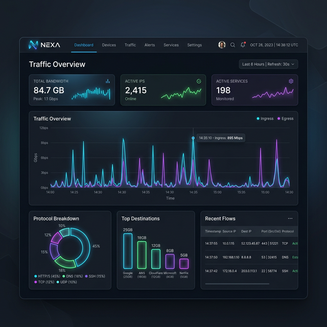

# FlowVision

FlowVision is a modern, lightweight, and self-hosted Netflow Analyzer built with Next.js, ClickHouse, and Telegraf. It provides beautiful, real-time insights into your network traffic, allowing you to easily monitor bandwidth, destinations, layer 7 applications, and historical anomalies.



## Features

- **Real-Time Traffic Dashboard**: Visualize top bandwidth consumers, source/destination IPs, ASNs, and protocols.
- **Layer 7 Application Detection**: Automatically maps ports to common applications (HTTPS, Secure DNS, BitTorrent, etc.).
- **GeoIP & ASN Mapping**: Deep dive into the physical origin of traffic with integrated flags and ISP names.
- **Interactive Flow Logs**: Search, sort, and paginate through thousands of raw flows instantly.
- **Dynamic Timezones**: Accurately view flow data relative to your browser's local timezone.
- **Threshold Alerts**: Configure custom rules to trigger alerts via Discord, Webhooks, Telegram, and more.
- **All-in-One Docker Deploy**: Runs out of the box with a single, highly optimized Docker container.

## Installation

FlowVision requires a working Docker environment.

1. Clone the repository:
```bash
git clone https://github.com/Adandu/FlowVision.git
cd FlowVision
```

2. Generate a secure admin password:
```bash
# Set your secure admin password via environment variable
export ADMIN_PASSWORD="ChangeMeInProduction123!"
```

3. Start the application:
```bash
docker compose up -d
```

4. Configure your router/firewall (e.g. OPNsense, pfSense, Unifi) to send **Netflow v9** or **IPFIX** data to the host IP of FlowVision on **Port 2055 (UDP)**.

5. Navigate to `http://<your-ip>:3000` in your web browser and log in with username `admin` and the password you set above.

## Documentation

For advanced deployment instructions, API endpoints, and configuration examples (including Auth and OIDC), please review the `docs/` folder:
- [User Guide](docs/USER_GUIDE.md)
- [Developer Architecture Guide](docs/DEVELOPER.md)
- [API Reference](docs/API_REFERENCE.md)

## Tech Stack

- **Frontend**: Next.js 14, Tailwind CSS, Lucide Icons, ECharts
- **Backend**: Next.js App Router (Node.js API)
- **Database**: ClickHouse (Optimized vector-based OLAP for time-series)
- **Collector**: Telegraf (Ingests Netflow v9 / IPFIX over UDP)

## License and Disclaimer

This project is licensed under the [MIT License](LICENSE.md).

> **NOTICE**: This application was generated using AI development tools ("vibecoding"). Please review the [NOTICE.md](NOTICE.md) regarding its deployment in critical or sensitive production environments. Use entirely at your own risk.
